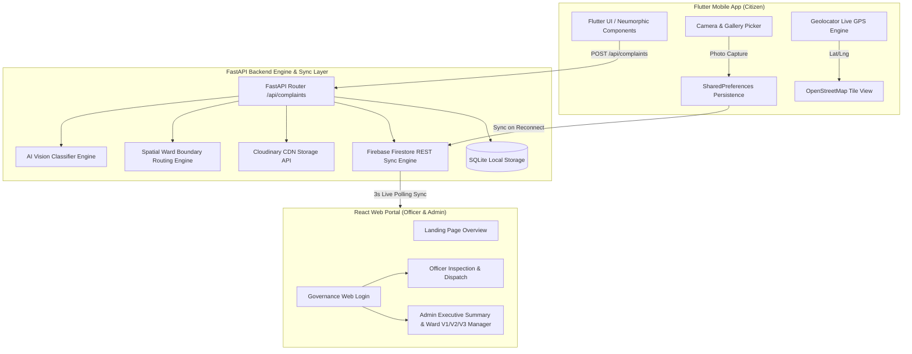
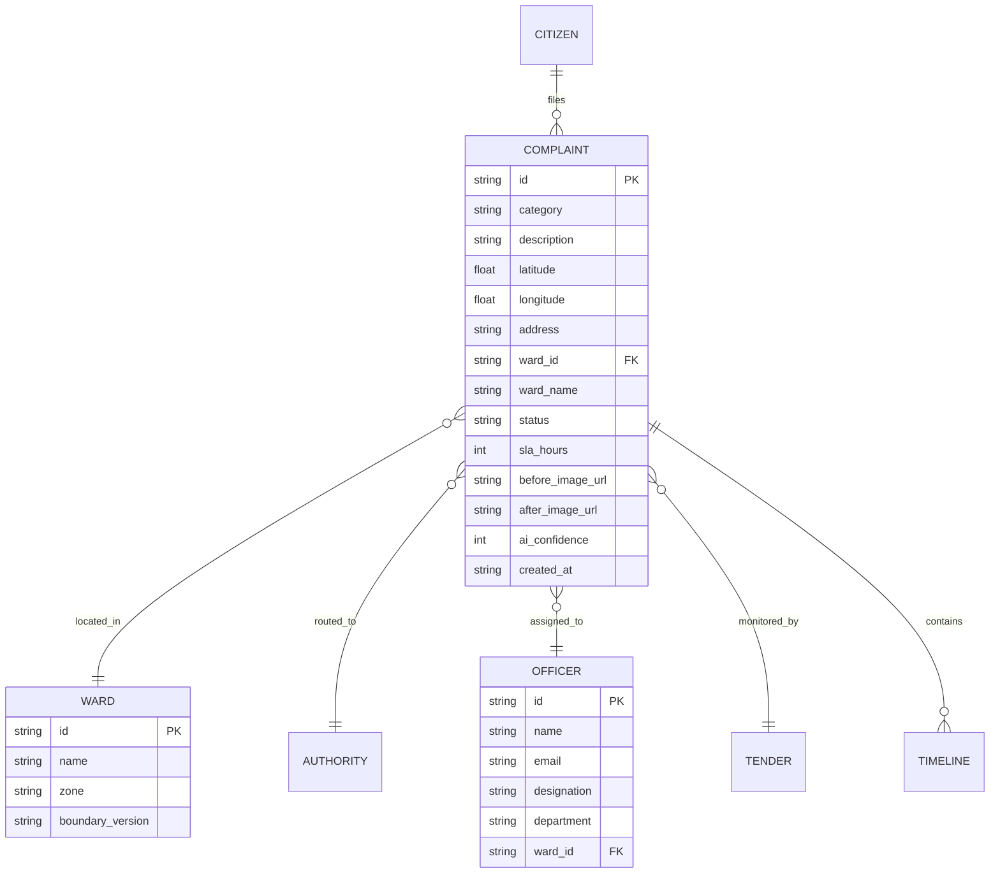

# System Architecture

[← Back to README](../README.md)

## System Diagram

---

## Request Walkthrough (Citizen Report to Officer Dispatch)

1. **Evidence Photo Capture & AI Scan**: Citizen opens Flutter App, captures photo via `image_picker`, and triggers 5-second AI Vision Classifier scan (`ai_classifier.py`).
2. **Spatial Geofencing & Location Confirmation**: Device's live GPS coordinates (`lat`, `lng`) are obtained via `geolocator`, pinned on `flutter_map` OpenStreetMap view, and mapped to MCC Ward 42 polygon boundaries (`routing_engine.py`).
3. **Cloudinary CDN Upload**: Local evidence image is converted to a Base64 Data URI and uploaded to Cloudinary CDN storage (`dycudtwkj`), returning an official `secure_url`.
4. **Firebase Firestore Synchronization**: Complaint document `#HM-1024` is pushed directly to Firebase Firestore REST API and SQLite database.
5. **Real-time Web Governance Portal Sync**: The Web Governance Portal (`AppContext.jsx` 3-second background polling loop) automatically updates the Officer Queue, assigning ticket `#HM-1024` to Senior AEE Eng. Rajesh Kumar with an active 24-hour SLA clock.

---

## Components

| Component | Responsibility | Tech Stack | Code Location |
|---|---|---|---|
| **Citizen Mobile App** | Photo evidence capture, AI scan animation, OpenStreetMap live pin, offline queuing | Flutter, Dart, `flutter_map`, `geolocator` | `src/mobile/lib/` |
| **Web Governance Portal** | Landing page, officer login, ticket inspection, ward boundary version manager | React 18, Vite, Neumorphic CSS, Lucide Icons | `src/dashboard/src/` |
| **FastAPI Backend Engine** | Core API endpoints, duplicate check, SLA calculation, Cloudinary upload handler | Python 3.11, FastAPI, Uvicorn, SQLite | `src/backend/main.py` |
| **Deterministic Routing Engine** | Polygon boundary mapping, zone calculation, authority & officer assignment | Python 3.11, Shapely/Polygon rules | `src/backend/routing_engine.py` |
| **AI Vision Classifier** | Image feature extraction, defect classification, confidence scoring (94%) | Python 3.11, Heuristic AI classifier | `src/backend/ai_classifier.py` |
| **Cloudinary CDN Service** | Unsigned REST image upload, Base64 URI processing, secure URL distribution | Cloudinary REST API | `src/backend/cloudinary_service.py` |

---

## Data Model

---

## Key API Endpoints

| Method | Endpoint | Purpose | Access Level |
|---|---|---|---|
| `POST` | `/api/auth/login` | Officer & Admin authentication | Public |
| `POST` | `/api/upload` | Base64 image upload to Cloudinary CDN | Public |
| `GET` | `/api/complaints` | Fetch all civic complaints with SLA status | Public / Officer |
| `POST` | `/api/complaints` | Submit new civic report with AI classification & routing | Citizen |
| `PUT` | `/api/complaints/{id}/status` | Update ticket status (In Progress, Resolved, Escalated) | Officer |
| `POST` | `/api/complaints/{id}/reopen` | Citizen flag issue persistent / reopen ticket | Citizen |
| `GET` | `/api/analytics` | Fetch city summary, ward heatmaps & hotspot data | Admin |

---

## Tech Stack Rationale

| Layer | Choice | Why this over alternatives |
|---|---|---|
| **Mobile App** | Flutter (Dart) | Single codebase delivering native 60fps performance on Android devices with robust plugin ecosystem (`image_picker`, `flutter_map`). |
| **Web Dashboard** | React + Vite | Lightning-fast HMR dev environment with zero-latency Neumorphic UI component rendering. |
| **Backend Engine** | FastAPI (Python) | High-concurrency async Python framework with native Pydantic validation and automatic OpenAPI docs. |
| **Sync Engine** | Firebase Firestore REST | Allows instant cross-device state synchronization without complex WebSocket infrastructure. |
| **Media CDN** | Cloudinary REST API | Reliable global image CDN delivering optimized HTTPS image URLs for evidence photos. |

---

## Data Sources & Jurisdiction Schemas

| Dataset | Source & Version | Used for |
|---|---|---|
| **MCC Ward Boundaries V3** | Mysuru City Corporation Ward Maps (2026 Schema) | Active spatial polygon geofencing & ward boundary routing |
| **MCC Ward Boundaries V2/V1** | Municipal Archives (2024 / 2022 Schema) | Historical version comparisons in Admin Boundary Manager |
| **OpenStreetMap Tiles** | OpenStreetMap Foundation (Carto Light tiles) | Tile rendering in Flutter mobile map and web field map |
